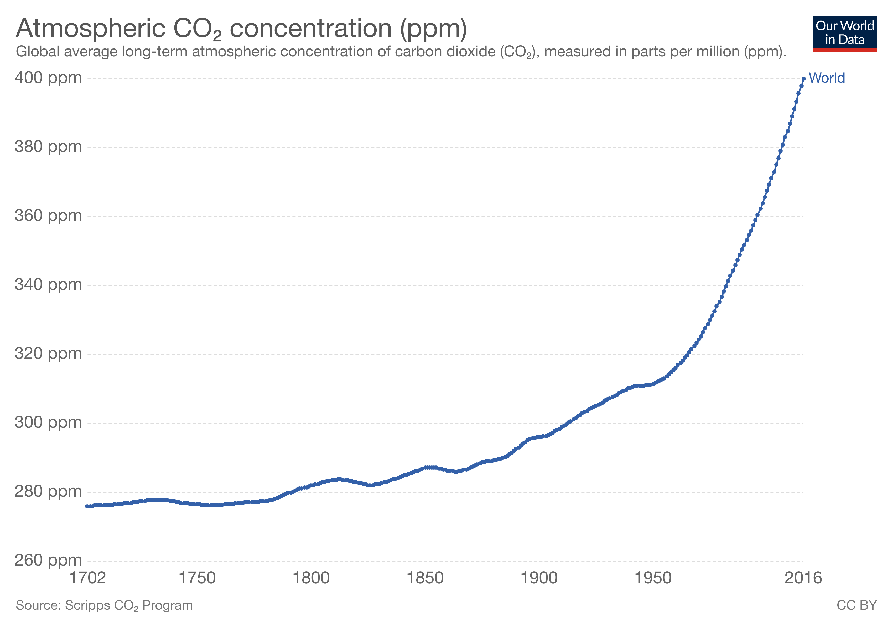

# Self_Study_Project

## Introduction 
This is a self study project that aims to review, compare and contrast five existing visualizations on the topic *"Climate change is caused by human activity"*.  
  

### Objective
The objective of this project is to understand what are the parameters that are important to consider when creating a data visualization, and how these parameters can help distinguish a good visualization from an average visualization.

  
### Methodology
1. Create an evaluation framework.

2. Collect 5 distinct data visualizations on the topic.

3. Collect atleast 1 visualization that argues against that climate change is caused by human activity.

4. Review, compare and contrast the visualizations based on the evaluation framework.

5. Provide an overall assessment and conclusion about what distinguishes a good data visualization from an average one, and what are the key takeaways from this study.

   

## Evaluation Framework
The evaluation criteria identified for this project include:       

1. **Data**: This criterion evaluates the data represented by the visualization in terms of __*integrity*__ and __*multivariability*__. It is grounded in the fact that a visualization is only as good as the data that goes in it.  _( Tufte, 2001: The Visual Display of Quantitative Information, Graphic Press. Pages 15, 34, 40, 53)_

2. **Design**: This criterion evaluates design of the visualization in terms of __*readability*__ _(Wexler, Shaffer, Cotgrave, 2017: The Big Book of Dashboards, Wiley. Pages 4-9)_ and __*chart type*__ _(Tufte, 2001: The Visual Display of Quantitative Information, Graphic Press. Page 51)_ used for visualizing the data. 

3. **Argument**: This criterion evalutes how complex ideas are communicated by the visualization in terms of __*clarity*__ of the intended argument and how __*compelling*__ the argument is for the intended audience. _( Tufte, 2001: The Visual Display of Quantitative Information, Graphic Press. Pages 13, 51)_

 
The complete evaluation framework is presented below: 
   
  

Criteria | Measure 1 | Measure 2 | Total Points
-------- | --------- | --------- | -------------
Data | **Integrity** *(1 point)*: Whether data is statistically validated and/or collected from verified sources. | **Multivariability** *(1 point)*: Number of dimensions added to the visualization by combining different data | 2
Design | **Chart type** *(1 point)*: Whether the design uses appropriate chart type and color  | **Readability** *(1 point)*: Whether the design or chart is easy to read and interpret  | 2
Argument | **Clarity** *(1 point)*: Whether the argument communicates complex ideas in a simple and clear manner | **Compelling** *(1 point)*: Whether the argument is compelling and truthful, or does it leave room for doubt or further exploration | 2
**Total Points** |        |       | **6**

 

## Climate Change Visualizations and their evaluation

### 1. Global Natural Disasters, 1980 - 2016, [National Geographic](https://www.nationalgeographic.com/magazine/2017/04/seven-things-to-know-about-climate-change/)
This chart shows that the number of climate related disasters has tripled since 1980.  

Source for data (*as mentioned on National Geographic's website*): [Munich RE NatCatSERVICE](https://www.munichre.com/en/reinsurance/business/non-life/natcatservice/index.html)

**Chart Evaluation**

**Criteria** | **Measure 1** | **Score** | **Measure 2** | **Score** | **Total Score**
------------- | --------------------------------- | :------: | ------------------------------- | :-----: |--------: 
**Data** | **Integrity**: The source is one of the world’s most comprehensive databases for analysing and evaluating natural catastrophes. | 1 | **Multivariability**: Data represented includes 9 different kinds of natural disasters.But, there is no other data dimension in terms of cause of natural disasters, other climatic factors such as greenhouse gases, temperature variation etc. | 0.5 | 1.5
**Design** | **Chart type**: Good use of *grouped histogram* and *line chart* to distinguish trends between different groups of natural disasters; choice of colors is good. | 1 | **Readability**: The chart fails to show individual numbers for each group for every year. In addition title for y-axis is missing, so it might not be immediatley clear whether the numbers are to be taken at face value or are in multiples of hundreds, thousands etc. | 0 | 1
**Argument** | **Clarity**: The graph depicts an overall increase in the total number of natural disasters between 1980 to 2016 and also shows the YoY change in each sub-group. | 1 |  **Compelling**: Although the chart does show an overall increase in the number of global natural disasters, the _red line_ showing number of earthquakes, tsunamis, volcanoes does not reflect the same trend, leaving room for further exploration. However, one can clearly see the multifold increase in the remaining categories. | 0.5 | 1.5
**Total Score** | | | | | **4.0** 

   

### 2. Atmospheric CO2 concentration (ppm), 1700 - 2016, [Our World in Data](https://ourworldindata.org/co2-and-other-greenhouse-gas-emissions#impact-of-emissions-on-atmospheric-concentrations)

This chart shows global average long-term atmospheric concentration of carbon dioxide (CO₂), measured in parts per million (ppm).

Source for data: [Scripps CO2 Program](http://scrippsco2.ucsd.edu/data/atmospheric_co2/icecore_merged_products) 
  
  

**Chart Evaluation**

**Criteria** | **Measure 1** | **Score** | **Measure 2** | **Score** | **Total Score**
------------- | --------------------------------- | :------: | ------------------------------- | :-----: |--------: 
**Data** | **Integrity**: The data for this graph is sourced from Scripps CO~2~ program which has lot of scientific literature and technical data on their website. | 1 | **Multivariability**: Chart does not include any data from increase in vehicles, industries etc. which can help explain the cause of the steep increase in CO~2~ emissions especially between 1950 - 2016. | 0 | 1
**Design** | **Chart type**: Use of a simple *line chart* makes the chart look clean, but it also appears _**boring**_ since there is only one set of information to interpret. | 0.5 | **Readability**: Chart axes are labeled and easy to read. The chart also indicates values through a slider on the original website _(unfortunately, not replicated in the image)_ | 1 | 1.5
**Argument** | **Clarity**: The chart clearly shows the increase in CO~2~ concentration. However, it does not reveal any direct causes for e.g. a sharp increase observed from 1950 onwards. | 0.5 |  **Compelling**: The chart clearly shows a steep increase in CO~2~ concentration from 1900 onwards. However, if the chart had included information from other data points such as population, vehicles, industries etc. it would have been a more compelling story to tell the audience. | 0.5 | 1.0
**Total Score** | | | | | **3.5** 

   

### 3. Global temperature change, 1850 - 2017 by Ed Hawkins, [Climate Lab Book](https://www.climate-lab-book.ac.uk/spirals/)

The animated climate spiral below is a different way to show the historically observed changes in global temperature. The website states that _"the original version quickly went viral, and was seen millions of times on Facebook and Twitter. A version was even used in the opening ceremony of the Rio Olympics!"_

Source for data: [Met Office Hadley Centre observations datasets, HadCRUT4](https://www.metoffice.gov.uk/hadobs/hadcrut4/)

   

**Chart Evaluation**

**Criteria** | **Measure 1** | **Score** | **Measure 2** | **Score** | **Total Score**
------------- | --------------------------------- | :------: | ------------------------------- | :-----: |--------: 
**Data** | **Integrity**: HadCRUT4 dataset has been used to create this graph. It is a new data set of global and regional temperature evolution from 1850 to the present. | 1 | **Multivariability**: It includes MoM and YoY data for change in temperature. | 1 | 2
**Design** | **Chart type**: The chart uses a climate spiral along with excellent use of colours to demonstrate the increasing difference in global temperatures. | 1 | **Readability**: even though the increase in warmtone of colours indicates increasing temperature, there is no temperature scale to show the actual values corresponding to each colour. Also, the reader cannot see the trend of change in temperature per  year | 0.5 | 1.5
**Argument** | **Clarity**: The chart clearly brings home the point that global temperatures are increasingly rising, even more rapidly in the current century.  | 1 |  **Compelling**: Given the audience, this chart can be very compelling to indicate how close the temperature is to reaching a difference of 1.5^0^C, the danger of which has been indicated by red color ring. | 1.0 | 2
**Total Score** | | | | | **4.5** 

   

### 4.  Climate Change: Beef has the biggest climate impact, [BBC News](https://www.bbc.com/news/science-environment-46384067)

This chart is part of a series of [7 charts on climate change](https://www.bbc.com/news/science-environment-46384067) published on BBC News' website. It talks about the impact of human food producing activities on the climate and shows greenhouse gas emissions from processing of various types of meat/proteins.

Source for data: Poore, J., & Nemecek, T. (2018). Reducing food’s environmental impacts through producers and consumers. Science, 360(6392), 987-992

   

**Chart Evaluation**

**Criteria** | **Measure 1** | **Score** | **Measure 2** | **Score** | **Total Score**
------------- | --------------------------------- | :------: | ------------------------------- | :-----: |--------: 
**Data** | **Integrity**: The data is taken from the paper published by Poore & Nemecek (2018) in Science which is a renowned scientific journal. | 1 | **Multivariability**: The chart lists different types of meat and proteins and shows greenhouse gas emissions from each. It categorizes impact of the greenhouse emissions which is an insightful addition. However, little information is displayed from farming practices, or overall contribution to total greenhouse gas emissions etc. | 0.5 | 1.5
**Design** | **Chart type**: Chart layout is clean, colors have been used approrpiately to signify low, average and high impact. However, one can say the layout is pretty novice. | 1 | **Readability**: The chart fails in terms of readability because of 2 reasons- _a._ meaning of low, average and high impact is not specified, _b._ actual values of the emissions can not be read from the chart. | 0 | 1
**Argument** | **Clarity**: From the chart it can be clearly seen that vegetable proteins produce very little emissions as compared to animal proteins. But what is not clear is the contribution to total greenhouse gas emissions, and its resulting impact on the climate.  | 0.5 |  **Compelling**: The chart does have a strong message that _highest impact vegetable proteins emit less greenhouse gases than low impact animal proteins_. However, the chart does leave one wanting to know more about nature of land use and farming practices that might lead to this variation and overall effect on the climate from these emissions. | 0.5 | 1
**Total Score** | | | | | **3.5** 

   

### 5.  Long Term Climatic Cycles from the Vostok Ice Core

Link to website: (http://ib.bioninja.com.au/standard-level/topic-4-ecology/44-climate-change/greenhouse-debate.html)

This chart is used to argue that climate has changed in the past and current trends merely reflect the Earth’s natural climatic cycle. 

Source for data: Not indicated on the website.

   

**Chart Evaluation:**

**Criteria** | **Measure 1** | **Score** | **Measure 2** | **Score** | **Total Score**
------------- | --------------------------------- | :------: | ------------------------- | :-----: |--------: 
**Data** | **Integrity**: The source for data is not indicated on the website or on the chart. It is also not clear who is the author/ where did the chart originate. | 0 | **Multivariability**: The chart lists difference in temperature but does not provide any other data to indicate reason for the difference. | 0 | 0
**Design** | **Chart type**: Chart layout is clean, with appropriate use of colors. | 1 | **Readability**: Chart axes are well labeled, however it is not clear which year is represented by _Today_ | 0.5 | 1.5
**Argument** | **Clarity**: The chart clearly indicates that over the 400,000 years of data represented, there have been climates warmer than today.  | 1 |  **Compelling**: The chart conveys that the spike in temperature is just another incident when compared with Earth's history. Appropriate use or colors and the well spread out spikes, do appear convincing that climate change might not be caused by human activity. However, it does leave the question of cause of spikes and dips in the temperature difference unanswered.   | 0.5 | 1.5
**Total Score** | | | | | **3.0** 

    

## Conclusion

# Part 2: Replicating Warming Stripes Visualization

Below is a replication of the Warming Stripes visualization using Tableau. 

Inspiration: Original visualization created by [Ed Hawkins]((https://www.climate-lab-book.ac.uk/2018/warming-stripes/).
Data source: Met Office Hadley Centre observations datasets, [HadCRUT4 Data](https://www.metoffice.gov.uk/hadobs/hadcrut4/data/current/download.html) 

Link to Tableau public: (https://public.tableau.com/views/WarmingStripes_Replication/WarmingStripes-Replication?:embed=y&:display_count=yes)  

Link to twbx file: (https://github.com/strivedi2/Self_Study_Project/blob/master/Part2_Tableau_files/)

